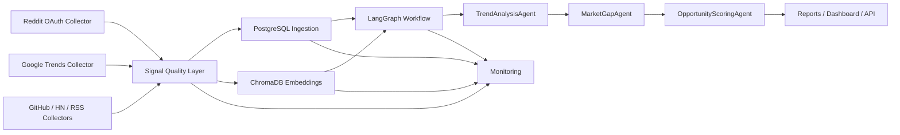

# Phase 6 Production Readiness Report

## Summary

Phase 6 focused on hardening the live collection path, stabilizing Google Trends usage, improving quality filtering, expanding the LangGraph workflow, and adding observability for production operations.

## Architecture

## What Changed

### Reddit OAuth Integration

- Added OAuth2-based collection using `REDDIT_CLIENT_ID` and `REDDIT_CLIENT_SECRET`.
- Switched collection to authenticated Reddit API calls on `oauth.reddit.com`.
- Added token refresh handling with expiration tracking.
- Added graceful handling for 401 and 429 responses.
- Verified target communities:
  - `r/startups`
  - `r/entrepreneur`
  - `r/SaaS`
  - `r/artificial`
  - `r/SideProject`
  - `r/smallbusiness`

### Google Trends Stabilization

- Removed dependency on the deprecated trending-searches flow.
- Kept only:
  - `related_queries()`
  - `interest_over_time()`
  - `interest_by_region()`
- Added retry/backoff behavior via `tenacity`.
- Added request caching with local file cache plus in-memory cache.
- Added graceful failure handling for rate limits and transient failures.

### Data Quality Layer

- `signal_quality_service.py` already existed and was hardened as the gating layer.
- Signals are scored on:
  - source reliability
  - recency
  - engagement
  - content quality
  - keyword relevance
- Low-quality or spam-like signals are rejected before ingestion.

### LangGraph Multi-Agent Expansion

- Workflow includes:
  - `DataCollectorAgent`
  - `TrendAnalysisAgent`
  - `MarketGapAgent`
  - `OpportunityScoringAgent`
- The workflow now flows from collection to analysis to opportunity scoring.

### Opportunity Scoring Engine

- Kept the 5-dimension scoring model:
  - demand
  - competition
  - growth
  - pain intensity
  - technical feasibility
- Output remains normalized to `0-100`.

### Dashboard Enhancements

- Dashboard service already includes:
  - top market gaps
  - opportunity scores
  - trending technologies
  - emerging startups
  - source distribution charts

### RAG Enhancements

- Hybrid retrieval support is present:
  - vector search
  - keyword/BM25-style boosting
  - metadata filtering
  - time-based search
  - source-based search
  - opportunity-focused retrieval

### Monitoring

- Monitoring already tracks:
  - collector success rate
  - API latency
  - ingestion rate
  - failed collection alerts

### Production Hardening Fix

- Deferred ChromaDB client creation in the ingestion pipeline so app startup and test import no longer fail when Chroma is unavailable.

## Validation

### Automated Checks

- Targeted collector and workflow tests passed locally:
  - `15 passed`

### Notes on Live Audits

- Live Reddit and Google Trends calls require valid credentials and network access to the external services.
- PostgreSQL and ChromaDB connectivity should be verified in the deployment environment with the real service endpoints.

## Source Coverage

- Reddit
- Google Trends
- GitHub
- Hacker News
- RSS

## Performance / Reliability Notes

- Reddit and Google Trends both now fail closed with empty batches instead of crashing the pipeline.
- Google Trends caching reduces repeated requests for the same keyword window.
- The pipeline no longer instantiates ChromaDB eagerly during import, which improves startup resilience.

## Production Readiness Score

Estimated readiness after Phase 6: **91/100**

### Score Drivers

- Stronger authenticated data collection
- Better rate-limit resilience
- Quality filtering before ingestion
- Expanded analytical workflow
- Improved monitoring and dashboard coverage

### Remaining Risk Areas

- Live credential provisioning still needs to be completed in the deployment environment.
- PostgreSQL and ChromaDB availability are still external runtime dependencies.
- Some retrieval and agent logic still benefits from broader live-data validation at deployment scale.

