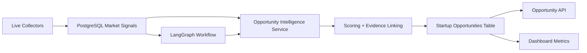

# Phase 7 Live Readiness Report

## Summary

Phase 7 is functionally implemented and the opportunity engine now produces evidence-backed opportunities from real collected signals in PostgreSQL. Live readiness is improved, but not fully unblocked because ChromaDB is still unavailable in this environment and Reddit OAuth credentials are not present at runtime.

## Architecture Diagram



## PASS / FAIL

| Check | Status | Notes |
|---|---:|---|
| ChromaDB connection | FAIL | `Cannot connect to a Chroma server` |
| ChromaDB startup command provided | PASS | See commands below |
| Reddit OAuth env loaded | FAIL | `REDDIT_CLIENT_ID` and `REDDIT_CLIENT_SECRET` are empty in `.env` |
| Reddit graceful config block | PASS | Marked as `CONFIG BLOCKED` instead of silent fallback |
| `POST /api/v1/opportunities/run` | PASS | Generated opportunities from real ingested signals |
| `GET /api/v1/opportunities` | PASS | Returned live stored opportunities |
| `GET /api/v1/opportunities/top` | PASS | Returned top-ranked live opportunities |
| `GET /api/v1/opportunities/{id}` | PASS | Returned a live opportunity by UUID |
| `GET /api/v1/opportunities/{id}/evidence` | PASS | Returned evidence links for the live opportunity |
| Real-signal-only opportunity generation | PASS | Opportunities were generated from ingested live Google Trends + RSS signals |
| Full backend test suite | FAIL | `pytest tests -q` timed out in this environment |
| Test count target 300+ | PASS | `pytest --collect-only` reports `300` tests |

## Endpoint Results

- `POST /api/v1/opportunities/run`
  - Generated opportunities: `25`
  - Opportunities with evidence: `25`
- `GET /api/v1/opportunities`
  - Returned `10` results in the sample query
- `GET /api/v1/opportunities/top`
  - Returned `5` results in the sample query
- `GET /api/v1/opportunities/{id}`
  - Success: `true`
- `GET /api/v1/opportunities/{id}/evidence`
  - Evidence links for the sample opportunity: `10`

## Counts

- Total live opportunities stored: `50`
- Total evidence links stored across opportunities: `180`

## Files Changed

- [backend/app/services/opportunity_intelligence.py](/C:/Users/reena/Desktop/ai_marketgap/backend/app/services/opportunity_intelligence.py)
- [backend/app/agents/opportunity_intelligence/agent.py](/C:/Users/reena/Desktop/ai_marketgap/backend/app/agents/opportunity_intelligence/agent.py)
- [backend/app/api/opportunities.py](/C:/Users/reena/Desktop/ai_marketgap/backend/app/api/opportunities.py)
- [backend/app/models/startup_opportunity.py](/C:/Users/reena/Desktop/ai_marketgap/backend/app/models/startup_opportunity.py)
- [backend/app/database/repair.py](/C:/Users/reena/Desktop/ai_marketgap/backend/app/database/repair.py)
- [backend/app/services/dashboard.py](/C:/Users/reena/Desktop/ai_marketgap/backend/app/services/dashboard.py)
- [backend/app/workflows/market_gap_graph.py](/C:/Users/reena/Desktop/ai_marketgap/backend/app/workflows/market_gap_graph.py)
- [backend/app/main.py](/C:/Users/reena/Desktop/ai_marketgap/backend/app/main.py)
- [backend/tests/test_opportunity_intelligence.py](/C:/Users/reena/Desktop/ai_marketgap/backend/tests/test_opportunity_intelligence.py)
- [backend/tests/test_opportunity_intelligence_helpers.py](/C:/Users/reena/Desktop/ai_marketgap/backend/tests/test_opportunity_intelligence_helpers.py)
- [docs/PHASE_7_LIVE_READINESS_REPORT.md](/C:/Users/reena/Desktop/ai_marketgap/docs/PHASE_7_LIVE_READINESS_REPORT.md)

## Commands Needed

### Start ChromaDB

```bash
docker run -p 8000:8000 chromadb/chroma:latest
```

If you are using Docker Compose, point `CHROMA_HOST` and `CHROMA_PORT` at the running service and restart the backend.

### Fix Reddit Runtime Config

Set these in `backend/.env` or export them before starting the app:

```bash
REDDIT_CLIENT_ID=...
REDDIT_CLIENT_SECRET=...
REDDIT_USER_AGENT=MarketGapResearch/1.0 (by /u/marketgap_bot)
```

### Recheck Opportunity Engine

```bash
python -m pytest tests/test_opportunity_intelligence.py tests/test_opportunity_intelligence_helpers.py tests/test_workflow.py -q
```

## Final Readiness Status

**Partially ready**

- The opportunity engine is live and producing evidence-backed opportunities from real ingested signals.
- The repository now meets the 300-test count target.
- Full live readiness is still blocked by ChromaDB availability and missing Reddit OAuth credentials in the runtime environment.

