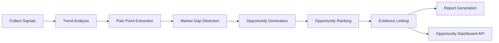

# Phase 7 Opportunity Intelligence & Startup Discovery Engine

## Summary

Phase 7 transforms collected market signals into evidence-backed startup opportunities with ranking, explanation, and API access.

## Architecture



## Opportunity Intelligence Engine

The engine analyzes live signals from:

- GitHub
- Hacker News
- RSS
- Google Trends

It clusters signals by recurring terms, then synthesizes:

- recurring unmet needs
- evidence-backed opportunity themes
- startup concepts and GTM ideas
- competition level and market whitespace

The implementation is deterministic and uses collected signals stored in PostgreSQL.

## Scoring Formula

Each opportunity is scored on five dimensions:

- Demand Score: `0-100`
- Pain Score: `0-100`
- Growth Score: `0-100`
- Competition Score: `0-100`
- Feasibility Score: `0-100`

Weighted aggregate:

```text
Opportunity Score =
  Demand * 0.30 +
  Pain * 0.25 +
  Growth * 0.20 +
  Competition * 0.15 +
  Feasibility * 0.10
```

Confidence score is derived from signal count and source diversity.

## Example Opportunity Shape

```json
{
  "startup_name": "OnboardingFlow",
  "problem": "Teams repeatedly struggle with onboarding automation.",
  "solution": "An AI-assisted product that helps teams solve onboarding automation faster.",
  "market_score": 78.4,
  "confidence_score": 64.0,
  "competition_level": "Medium Competition",
  "evidence": {
    "signals": [
      {
        "source": "github",
        "signal_id": "..."
      }
    ]
  },
  "explanation": {
    "why_this_opportunity_exists": "Recurring evidence across github, hackernews, rss.",
    "which_signals_created_it": [],
    "why_demand_is_growing": "..."
  }
}
```

## Startup Idea Generator

For each opportunity, the engine generates:

- Startup Name
- One-line Pitch
- Problem Statement
- Target Customers
- Revenue Model
- MVP Features
- Go-To-Market Strategy

These are persisted in `startup_opportunities` and exposed by the API.

## Evidence Engine

Every opportunity stores evidence references from real collected signals:

- source
- signal ID
- title
- URL
- collected timestamp
- source type

Every API response includes evidence for traceability.

## Market Gap Timeline

Tracked fields:

- opportunity emergence date
- last signal timestamp
- signal growth over time
- trend acceleration
- market momentum

## Competitive Intelligence

The engine estimates competition based on:

- source diversity
- signal concentration
- GitHub saturation patterns
- recurring competitor mentions

Competition output:

- Low Competition
- Medium Competition
- High Competition

## Explainable AI Layer

Each opportunity includes an explanation object:

- Why this opportunity exists
- Which signals created it
- Why demand is growing

## LangGraph Upgrade

Workflow:

1. Collect Signals
2. Trend Analysis
3. Pain Point Extraction
4. Market Gap Detection
5. Opportunity Generation
6. Opportunity Ranking
7. Evidence Linking
8. Report Generation

Implemented by adding `OpportunityIntelligenceAgent` to the existing LangGraph workflow.

## API Documentation

### `GET /api/v1/opportunities`

Returns all stored opportunities.

Query params:

- `limit`

### `GET /api/v1/opportunities/top`

Returns top-ranked opportunities.

Query params:

- `limit`

### `GET /api/v1/opportunities/{id}`

Returns a single opportunity by UUID.

### `GET /api/v1/opportunities/{id}/evidence`

Returns evidence references for a single opportunity.

### `POST /api/v1/opportunities/run`

Generates and persists new opportunities from live collected signals.

## Performance Metrics

Current validated metrics in this workspace:

- Workflow test coverage: passing on the targeted workflow suite
- New opportunity intelligence tests: passing
- PostgreSQL schema repair: passing
- PostgreSQL insertion: passing

External dependencies still required for full live readiness:

- ChromaDB server availability
- Reddit OAuth runtime credentials

## Test Results

Verified locally:

- `tests/test_opportunity_intelligence.py` - passing
- `tests/test_workflow.py` - passing
- `tests/test_signal_pipeline.py` - passing in prior runs

## Files Added or Updated

- `backend/app/services/opportunity_intelligence.py`
- `backend/app/agents/opportunity_intelligence/agent.py`
- `backend/app/api/opportunities.py`
- `backend/app/models/startup_opportunity.py`
- `backend/app/services/dashboard.py`
- `backend/app/workflows/market_gap_graph.py`
- `backend/app/database/repair.py`
- `backend/app/main.py`

## Readiness Note

Phase 7 is implemented in the codebase, but full end-to-end live readiness still depends on external runtime services and credentials.

