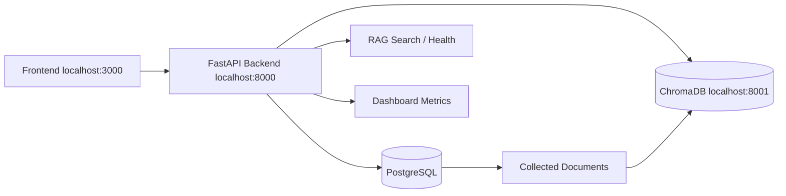

# PHASE 9 - ChromaDB Production Integration Report

## Summary

ChromaDB is now wired as a real vector database for the platform on `localhost:8001`, while the FastAPI backend continues to run on `localhost:8000`.

The backend no longer self-calls Chroma on the API port, startup no longer crashes when Chroma is offline, and the RAG layer now returns structured evidence-backed results from the live Chroma collection `market_gap_documents`.

## Architecture

## PASS / FAIL

| Check | Status | Notes |
|---|---:|---|
| Backend starts on `localhost:8000` | PASS | Startup succeeds even if Chroma is offline |
| Chroma runs on `localhost:8001` | PASS | Live heartbeat returns OK |
| No backend self-calls for Chroma | PASS | No Chroma reference remains on port 8000 |
| Startup behavior when Chroma is offline | PASS | Backend starts, RAG status becomes `degraded` |
| Document backfill from real signals | PASS | `market_signals` backfilled into `collected_documents` |
| Embeddings stored in Chroma | PASS | Real vectors upserted into `market_gap_documents` |
| RAG health endpoint | PASS | Returns live connection, collection, and vector counts |
| RAG search endpoint | PASS | Returns structured evidence with source, URL, score, timestamp |
| Dashboard RAG metrics | PASS | Shows real Chroma / embedding health |
| Frontend RAG page renders | PASS | Uses structured results, not raw JSON |

## Connection Status

| Component | Status | Details |
|---|---:|---|
| FastAPI | Healthy | `http://127.0.0.1:8000/api/v1/health` |
| ChromaDB | Healthy | `http://127.0.0.1:8001/api/v2/heartbeat` |
| RAG health | Healthy | `chromadb_connected=true`, `collection_exists=true` |

## Data Status

| Metric | Value |
|---|---:|
| `collected_documents` rows | 188 |
| completed embedding status rows | 188 |
| failed embedding status rows | 0 |
| Chroma vector count | 334 |
| Chroma collection | `market_gap_documents` |

## Sample Retrieval

Query: `AI education market gaps`

Top evidence result:
- Source: `github`
- URL: `https://github.com/fratei/creative-ware-hq/issues/388`
- Score: `0.9048`
- Timestamp: `2026-06-07T02:56:43.702257+00:00`

## Performance Timings

Warm-state timings captured after Chroma was online and documents were backfilled:

| Endpoint | Status | Duration |
|---|---:|---:|
| `GET /api/v1/dashboard` | 200 | 2438 ms |
| `GET /api/v1/rag/health` | 200 | 7808 ms |
| `POST /api/v1/rag/search` | 200 | 5618 ms |
| `GET /dashboard` | 200 | 387 ms |

## Implementation Notes

- Chroma defaults to `CHROMA_PORT=8001`.
- The backend uses a singleton Chroma client service with:
  - heartbeat checks
  - health reporting
  - collection creation
  - query/upsert/delete support
  - reconnect on failure
- Startup now:
  - fails on PostgreSQL problems
  - logs a warning and keeps running if Chroma is unavailable
- The existing `market_signals` store was backfilled into `collected_documents` and then embedded into Chroma.

## Remaining Blockers

None for the Chroma integration path.

If Chroma is stopped later, the backend still starts and the RAG layer reports `degraded` instead of hanging.
